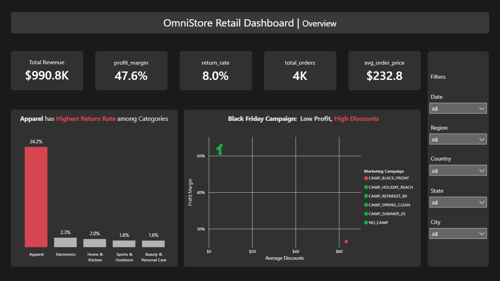

# 📊 OmniStore End-to-End Strategic Retail Analytics

## 📌 Project Overview
This portfolio project delivers a rigorous, multi-tiered analytics framework designed to diagnose margin leakage, evaluate promotional efficiencies, and resolve fulfillment crises for **OmniStore Global Retail Group**.
The architecture bridges data engineering and strategic business intelligence across three core phases:
1. SQL: Production-grade ETL, automated multi-pass deduplication, and row-by-row financial reconstruction.
2. Python (`scipy.stats` & `pandas`): Inferential statistics and rigorous hypothesis testing to mathematically isolate root causes behind operational anomalies.
3. Power BI: High-fidelity executive-level interactive dashboard applying human-centric design patterns and dynamic data storytelling to drive leadership decisions.
> **Note on Data Generation:** The underlying operational dataset was programmatically generated using AI tools to simulate complex, real-world database friction points, terminal system errors, and localized logistical data noise.

## 🛠️ Phase 1: Data Engineering & Validation (SQL)
* **Advanced Deduplication Pass:** Engineered a single-pass Common Table Expression (CTE) utilizing `ROW_NUMBER()` `OVER(PARTITION BY ...)` to purge exact "double-click" system duplicates while applying windowed partitioning to smoothly reconcile partial audit variances.
* **Financial Reconstruction:** Discovered and neutralized a systemic 15x script multiplier injected into gross revenue logs. Rebuilt the corporate revenue model row-by-row using core unit economics (`Unit_Price * Quantity`) to restore logic down to net sales and operational profit lines.
* **Temporal Imputation:** Formulated conditional `CASE WHEN` and datetime mechanics to recover corrupted delivery timelines and systemic `0000-00-00` status resets.

## 🧪 Phase 2: Root-Cause Statistical Diagnostics (Python)
Instead of relying on surface-level visual observations, advanced statistical tests were conducted to validate business assumptions scientifically:
### 1. The Marketing Discount Trap (`CAMP_BLACK_FRIDAY`)
* **Hypothesis:** Testing whether the severe margin drop (~26%) seen in Black Friday was statistically driven by its extreme promotional cuts or if it was a random operational variation.
* **Methodology:** Isolated pricing structures into two independent vectors and executed a **Two-Sample Independent T-Test** via `scipy.stats.ttest_ind`.
* **Result:** Replaced the null hypothesis with an extreme, near-zero p-value ($p < 0.05$), statistically proving to executive leadership that the horizontal discounting model was the direct cause of margin erosion.
### 2. The Borderless Apparel Return Crisis
* **Hypothesis:** Testing if the 20%+ return rate in Apparel was a localized shipping/logistical failure unique to certain regions, or an inherent product/sizing defect constant across all countries.
* **Methodology:** Generated a multi-variable cross-tabulation matrix (`pd.crosstab`) mapping `customer_country` against `order_returned` for the Apparel segment, then ran a **Chi-Square Test of Independence** (`chi2_contingency`).
* **Result:** Returned a high p-value ($p = 0.12$), statistically proving that fulfillment routes and regional boundaries have no relationship with the returns. The crisis is a borderless, systemic sizing or quality control issue at the manufacturing source.

## 📉 Phase 3: Executive Strategic Dashboard (Power BI)

The entire analytical journey was synthesized into a high-fidelity, interactive executive interface designed under strict corporate dashboard design paradigms:
* **Human-Centric UI/UX:** Built on a premium Dark Mode theme using custom contrasting container containers to maximize readability and reduce executive cognitive fatigue.
* **Strategic Visual Anchoring:** Employs pre-attentive visual attributes—utilizing targeted **Red Alert highlighting** exclusively on the critical Apparel column and the isolated Black Friday scatter coordinate, leaving optimized areas in neutral tones.
* **Advanced Data Storytelling Architecture:**
  * **Macro Summary:** Top-layer high-level KPI cards reporting absolute corporate health indicators (Revenue, Margin %, Returns) to frame the executive context.
  * **Diagnostic Visuals:** A tailored Column Comparison Chart for categorical returns alongside a Scatter Plot cross-examining margins against discount volumes to visually lock in the negative correlation.
  * **Interactivity:** A dedicated collapsible Right-Hand Filter/Slicer Pane maximizing canvas space while giving stakeholders regional and temporal filtering autonomy.
 
## 📁 Repository Structure
* `/data`: Contains the raw dataset.
* `/sql-scripts`: SQL queries used to clean and standardize the data and data exploration and analysis.
* `/python-notebooks`: Python code.
* `/powerbi-dashboard`: The main packaged Power BI workbook..
* `overview_dashboard.png`: Image of the finished dashboard pag
